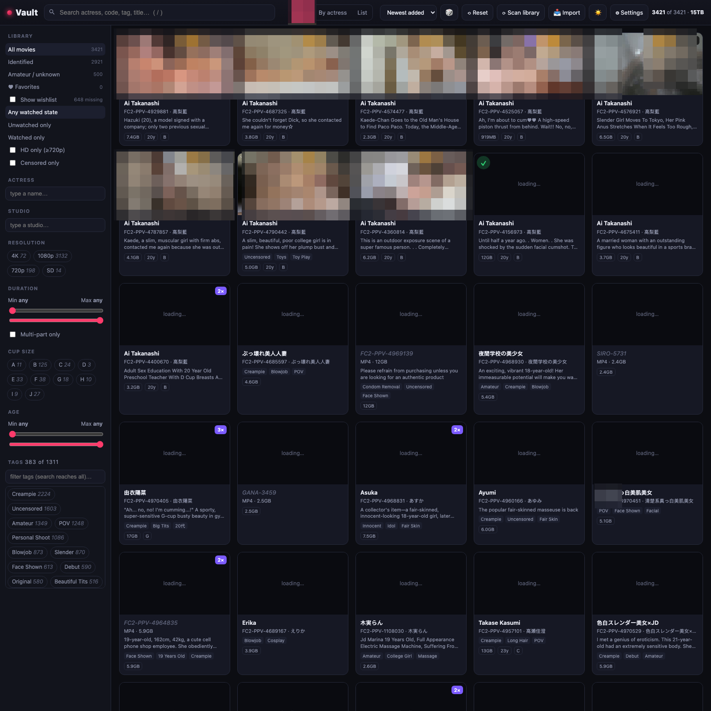
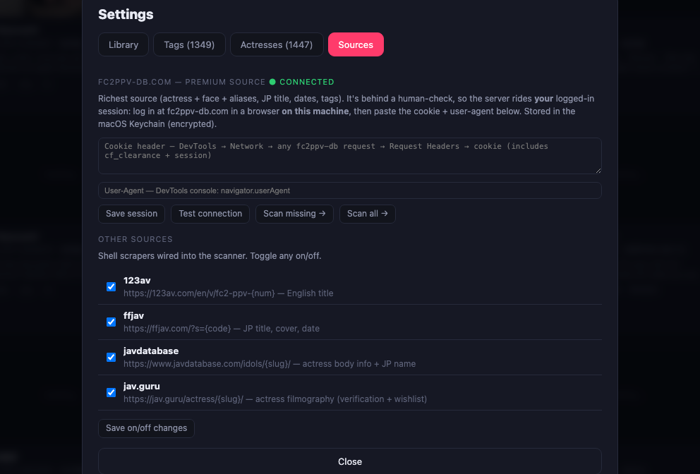

# Vault

**A self‑hosted, filterable “Plex for FC2 / JAV.”** Point it at a folder of movies and it becomes a fast, private web app: a poster wall with streaming playback, deep metadata filters, an actress catalog with faces and body stats, a wishlist of titles you don’t own yet, and one‑click tools to tidy, tag, and enrich your library from the web.

Runs entirely on your machine. No cloud, no accounts, no telemetry — a single Python file serves a single HTML page. The UI is fully responsive, so the same page works on a phone over your LAN or VPN.

> **Read [Privacy & safety](#privacy--safety) before exposing it.** Vault listens on **all interfaces** and has **no login and no HTTPS**. On a trusted home network that is the point; it is not safe to port‑forward to the internet.



---

## Contents

- [Features](#features)
- [Requirements](#requirements)
- [Install](#install)
- [Configure](#configure)
- [Run](#run)
- [A quick tour](#a-quick-tour)
- [User guide](#user-guide)
- [How metadata works](#how-metadata-works)
- [Project layout](#project-layout)
- [Building a release](#building-a-release)
- [Privacy & safety](#privacy--safety)
- [Troubleshooting](#troubleshooting)

---

## Features

**Browse & find**
- Grid, **By‑actress**, and **List** views over your whole library
- Sidebar filters: identified / amateur, **favorite movies**, **favorite actresses**, **wishlist**, watched state, HD, uncensored, actress, studio, resolution, duration, cup size, age
- Full‑text search across actress (incl. **aliases** and Japanese names), code, title, and tags — matches surface to the top
- Sort by **date added** (true first‑seen, not the copied file date), release, size, duration, rating, favorites, actress, code, or shuffle

**Use it anywhere**
- One responsive page — no separate mobile site and no UA sniffing; the layout keys off window width and pointer type, so a narrow desktop window behaves like a phone
- Phone layout: two‑column poster wall, filters in a slide‑over **☰ Filters** drawer, and a player that stacks the video above **Info** / **Parts · Related** tabs
- Reachable from any device on your LAN or over a VPN back to it (**no authentication** — see [Privacy & safety](#privacy--safety))
- The grid renders in batches as you scroll, so a multi‑thousand‑item library stays inside mobile Safari's memory budget

**Watch**
- In‑browser streaming with HTTP range requests + `sendfile` (fast seeks over SMB)
- Multi‑part playback with auto‑advance
- Keyboard shortcuts (space/k, ←→ / j l seek, ↑↓ volume, m, f, 0–9, `< >` speed)
- HEVC handled natively where the browser supports it, with a clear fallback panel where it doesn’t

**Curate**
- Rich edit panel: actress (EN + JP, with autocomplete), age, cup, height, measurements, censorship toggle, EN/JP titles
- **Reassign** a single misgrouped movie to another actress straight from the player (**⇄**) — relinks just that title, never renames the actress it left
- **Multi‑select** (shift / ⌘‑click) → bulk‑assign one actress to many movies
- **Organize** the folder on disk: normalize `…/<CODE>/<CODE>.ext`, quarantine junk, flag/relocate duplicates — preview first, nothing deleted
- **Organize by actress**: fold every movie into `…/<Actress>/<CODE>/` to match the catalog (so the disk follows reassignments) — preview first, only moves, never deletes
- **Settings** hub: change the library folder, clear caches, manage tags (rename/merge + **JP→EN translation**), manage actresses (rename, merge, **find duplicates**), and connect sources

**Enrich**
- **Scan metadata** from the web (English/Japanese titles, covers, dates, tags) across your library
- **Enrich from web** per actress: body info, JP name, aliases — **verified by FC2‑code overlap** so you don’t attach the wrong same‑name person, and it fills her **wishlist** from her filmography

## Requirements

- **Python 3.8+** (standard library only — no `pip install`)
- **ffmpeg / ffprobe** on your `PATH` (posters + duration/resolution/codec)
- A modern browser (Chrome, Brave, Safari, Firefox)
- macOS or Linux (developed on macOS; the optional fc2ppv‑db session store uses the macOS Keychain, with a file fallback elsewhere)

Install ffmpeg:

```bash
brew install ffmpeg          # macOS
sudo apt install ffmpeg      # Debian/Ubuntu
```

## Install

```bash
git clone <your-repo-url> vault
cd vault
```

There’s nothing to build or compile.

## Configure

On first run Vault copies `config.example.json` to `config.json`. Edit it to point at your movies:

```json
{
  "library": "/path/to/your/movies",
  "port": 8730
}
```

You can also set the library from the CLI or in **Settings → Library** later:

```bash
python3 serve.py --library "/path/to/your/movies"
```

## Run

```bash
python3 serve.py
```

Then open **http://127.0.0.1:8730/**. First launch walks the library (slower over a network share); after that it boots instantly from a cached index and refreshes in the background.

To run detached:

```bash
python3 serve.py > vault.log 2>&1 &
```

### On your phone or another computer

Vault listens on every interface, so from any device on the same network (or connected to your LAN over VPN) open:

```
http://<this-machine-ip>:8730/
```

Find the address with `ipconfig getifaddr en0` (macOS) or `hostname -I` (Linux). The layout adapts on its own — no separate mobile site, no app to install:

- **Phone:** two‑column poster wall; filters live behind a **☰ Filters** drawer; the player stacks the video on top with **Info** and **Parts / Related** tabs beneath it.
- **Tablet / small window:** the same rules key off window width, so a narrow desktop window gets the compact layout too.

The grid renders in batches as you scroll, which is what keeps a multi‑thousand‑item library from exhausting mobile Safari's per‑tab memory.

Nothing here is authenticated — see [Privacy & safety](#privacy--safety).

---

## A quick tour

**Grid** is the home view — a poster wall with actress, code, tags, and size/age/cup pills. Click a card to play; **shift/⌘‑click** to select several.

**Detail / player** shows the movie with the actress up top (English → Japanese → code), her stats as pills, full technical metadata, tags, rating, and a filmography rail of her other titles (owned + wishlist).


**Settings** is where you manage everything — library folder & cache, tags, actresses, and sources.



See the **[full user guide](docs/USER_GUIDE.md)** for a screenshot walkthrough of every feature.

## User guide

The detailed, screenshot‑driven guide lives in **[`docs/USER_GUIDE.md`](docs/USER_GUIDE.md)** and covers:

- Browsing, filtering, sorting, and the wishlist
- Playback and keyboard shortcuts
- Editing a movie’s actress & metadata
- Reassigning a misgrouped movie to another actress
- Multi‑select bulk actress assignment
- Organizing the library folder (by `<CODE>` and **by actress**)
- Scanning & enriching from the web (and the verification model)
- Settings: library, cache, **tags + translations**, **actresses + dedup**, sources
- Connecting the premium **fc2ppv‑db** source

## How metadata works

Vault treats your **filesystem as the spine** and the catalog database (`data/catalog.db`) as an enrichment overlay. Each source contributes only the fields it’s best at, and Vault never overwrites a value you edited by hand. See **[`SOURCES.md`](SOURCES.md)** for the per‑field priority table and the exact scraping model.

Highlights:
- **Local first** — duration/resolution/codec from `ffprobe`, posters from `ffmpeg`.
- **Shell scrapers** — 123av (English titles), ffjav (JP title, cover, date).
- **Verified actress enrichment** — javdatabase + jav.guru, gated by FC2‑code overlap with your library.
- **fc2ppv‑db** (optional, premium) — actress faces, aliases, JP titles, dates, tags, full filmographies. It sits behind a human‑check, so Vault rides *your* logged‑in browser session (you pass the check, the server reuses the session). Set it up in Settings → Sources.
- **Canonical tags** — every scraped tag is routed through the JP→EN / merge table before it’s stored: Japanese tags become their English label, merged tags stay merged (a merge you make is remembered for future scans), and untranslated Japanese one‑offs are dropped instead of polluting the set. English tags without a mapping are kept as‑is.

## Project layout

```
serve.py         # the app + HTTP API (Python stdlib, single file)
index.html       # the entire front‑end (vanilla JS, no build step)
scan.py          # web scrapers + enrichment (123av, ffjav, javdatabase, jav.guru, fc2ppv‑db)
organize.py      # preview‑then‑apply library tidy (never deletes/overwrites)
dedupe.py        # find & merge duplicate actress records
data/catalog.db  # preloaded catalog (SQLite): actresses, works, tags, aliases, links
config.json      # your library path + port (gitignored)
docs/            # this guide + screenshots
```

## Building a release

`make_release.sh` assembles a clean, self‑contained, GitHub‑ready copy (app + scrapers + a fresh DB snapshot + a `start.command` launcher):

```bash
./make_release.sh            # full build — ships YOUR ownership flags. Personal.
./make_release.sh --rc       # shareable release candidate (see below)
./make_release.sh --public   # --rc, plus sanitized imagery. This is what's on GitHub.
```

All three strip the author's absolute paths from the shipped scripts. They differ in what the bundled catalog says about *you*, and in what the screenshots show.

### `--public` — the published build

Everything `--rc` does, plus:

- **Actress portrait blobs are cleared** from the catalog (text metadata is untouched).
- **Screenshots are swapped for a sanitized set** in `docs/images_public/`:
  - Library views (grid, multi‑select) keep their layout with the **poster art pixelated**.
  - The settings / scan / organize / import dialogs are **cropped to the dialog** — nothing needs censoring once the library behind them is out of frame.
  - The player and actress‑overview shots are omitted, and the docs that referenced them are pruned so no image link dangles.

Regenerate the sanitized set after taking new screenshots:

```bash
python3 tools/censor_shots.py docs/images /tmp/px     # pixelate poster art
```

`tools/censor_shots.py` finds photographic regions structurally rather than by hand‑placed coordinates — Vault's chrome is flat and near‑black while poster art is bright, textured and coloured — then boxes each region so a whole poster is covered even where detection only caught part of it. UI text stays sharp.

### `--rc` — the shareable build

Use this for anything public. It keeps the catalog as a **prebuilt metadata library** — every title, cover, tag, actress profile, portrait, alias and filmography link survives — while removing every signal about what you personally own or want:

| Removed | Why |
|---|---|
| `works.in_library` → `0` | marks the files you hold |
| `works.availability` → `available` | `missing` is your wishlist |
| `works.source` `fs`/`manual`/`user` → `catalog` | `fs` means "found on my disk" — that flag alone re‑identifies the whole owned library |
| `actresses.source` `manual`/`csv` → `catalog` | same, for hand‑curated actress rows |
| works rows with **no** metadata at all | their only content is "this code was on my disk" |
| `crawl` table | scraper bookkeeping, not movie or actress data |

`VACUUM` runs last so deleted rows can't be recovered from the freelist. External provenance (`bigboobs.pink`, `jav-forum:*`, `javfc2`, `jav.guru`) is deliberately kept — that's attribution, documented in `SOURCES.md`.

The build then **verifies itself and fails rather than shipping a leak**, re‑checking each item above plus: no personal paths or hostnames in any shipped text file, and no `.DS_Store` / `config.json` / `cache/`. A clean run ends with:

```
RC verify: clean (no ownership flags, no personal paths, no runtime cruft).
```

Watched state, favorites (movies **and** actresses) and ratings never enter this picture — they live in a **`userdata.json` sidecar** next to the DB, the single source of truth, kept deliberately **separate from `catalog.db`** so they survive a catalog rebuild/reimport and a browser cache wipe. They are your personal state and are never part of the shipped catalog.

**What a recipient gets:** their own scan populates the grid; the bundled catalog enriches whatever codes they happen to own. Since nothing is flagged `missing`, they get no wishlist ghosts until they enrich an actress themselves.

## Privacy & safety

- **No cloud, no telemetry.** Vault talks to the internet only when *you* press a scrape/enrich button. It has no accounts and phones home to nothing.
- **It is not access‑controlled.** The server binds `0.0.0.0`, so anyone who can reach the port gets the whole library — there is **no login and no TLS**. Two endpoints act on the host machine rather than just returning data:
  - `POST /api/open` — opens a file in your desktop video player
  - `POST /api/reveal` — reveals it in Finder

  Treat reachability as the only control. Keep it on a network you trust (LAN or a VPN back to your LAN); do **not** port‑forward it or put it on a public/coworking Wi‑Fi. To pin it back to this machine only, change the bind in `serve.py`:

  ```python
  srv = ThreadingHTTPServer(("127.0.0.1", port), Handler)   # was "0.0.0.0"
  ```
- **Non‑destructive by design.** Organize *moves* junk/duplicates into recoverable folders and never deletes or overwrites; enrichment is fill‑if‑empty and never clobbers your edits.
- **Secrets** (the optional fc2ppv‑db session) are stored in the **macOS Keychain** (encrypted), or a `0600` file elsewhere — never in the repo.
- Web scraping honors each site’s access model; the one human‑checked source is only ever reached through a session **you** authenticate.

## Troubleshooting

| Symptom | Fix |
|---|---|
| “no valid library folder” on start | Set `library` in `config.json`, or `--library "…"`, or **Settings → Library**. |
| No posters / durations | Install `ffmpeg`/`ffprobe` and ensure they’re on `PATH`. |
| Slow first boot | Normal over SMB — it caches after the first walk and boots instantly next time. |
| A movie didn’t appear after copying it in | **Scan library** re‑indexes the filesystem first; new folders show up then. |
| A movie you own still shows Status **missing** | Its catalog row is stale. Any scan/rescan reconciles it — the log prints `[db] N work(s) marked available`. The import pipeline now marks them as it goes. |
| Can’t reach it from your phone | Use the machine’s LAN IP, not `127.0.0.1`; check both devices are on the same network (or the VPN is up) and that a firewall isn’t blocking the port. |
| Phone tab reloads or dies on a huge library | Should not happen — the grid renders in batches. If it does, narrow the view with a filter and file it as a bug. |
| Newly added folder not on top of “Newest added” | Vault sorts by **first‑seen**; a freshly‑dropped `<CODE> - Name` folder is treated as new. |
| Wrong port after launch | `serve.py` remembers the last `--port` in `config.json`; edit it back or pass `--port 8730`. |
| fc2ppv‑db **Test connection** fails with a fresh cookie | Vault tries the request over both IPv4 and IPv6 (a `cf_clearance` cookie is bound to the exact address that solved Cloudflare's check, and dual‑stack machines don't always use the same one). If it still fails, the cookie has expired — re‑copy it — or your browser is on a different public IP than the server (e.g. a VPN). |
